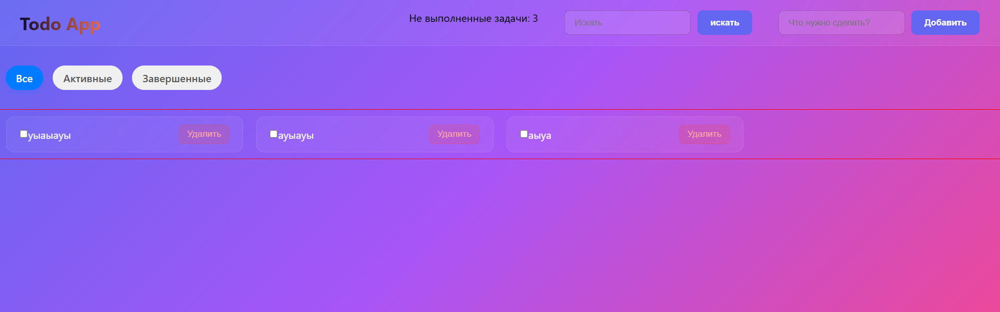

# React Todo App (Zustand + SCSS)

Простой и функциональный список задач, написанный на **React** с использованием стейт-менеджера **Zustand**.

### Что умеет приложение:
* **CRUD**: Добавление, удаление и редактирование статуса задач.
* **Фильтрация**: Переключение между категориями "Все", "Активные" и "Завершенные".
* **Поиск**: Быстрый поиск задач по названию.
* **Persistence**: Все задачи сохраняются в `LocalStorage` — данные не пропадают после перезагрузки страницы.
* **Стилизация**: Адаптивная верстка на **SCSS**.

### Технологии:
* React (Vite)
* Zustand (State Management + Persist middleware)
* SCSS (Styles)

### Как запустить локально:
1. Клонировать репозиторий: `git clone <ссылка_на_твой_репозиторий>`
2. Установить зависимости: `npm install`
3. Запустить проект: `npm run dev`

